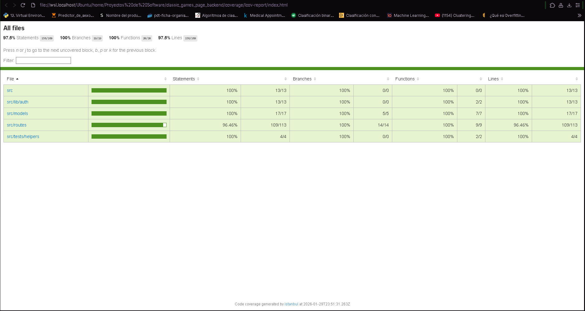

# 🟢 Backend - Classic Games Platform - Daniel Vera

API REST desarrollada con Node.js y Koa que gestiona autenticación de usuarios y persistencia de favoritos.

---

## 🚀 Deploy

🔗 https://classic-games-page-backend.onrender.com

---

## 🛠️ Tecnologías

### Backend

- Node.js
- Koa
- Sequelize
- PostgreSQL
- JWT

### Testing

- Jest
- Supertest

### DevOps / Infraestructura

- Docker
- Docker Compose
- GitHub Actions
- Docker Hub
- VPS Deployment
- CI/CD

---

## 📦 Características principales

- Autenticación con JWT
- Registro e inicio de sesión de usuarios
- Persistencia de favoritos
- API RESTful
- Manejo centralizado de errores
- Integración con PostgreSQL
- Testing automatizado
- Dockerización completa del backend
- Deploy automatizado mediante CI/CD

---

## 🔐 Autenticación

La API utiliza JSON Web Tokens (JWT) para proteger rutas.

El token debe enviarse en el header:

```http
Authorization: Bearer {token}
```

---

## 🐳 Docker

El proyecto se encuentra completamente dockerizado utilizando:

- Docker
- Docker Compose

Incluyendo:

- Backend Node.js
- Base de datos PostgreSQL
- Variables de entorno
- Networking entre contenedores

---

## ⚙️ CI/CD

El proyecto cuenta con pipeline automatizado mediante GitHub Actions.

### Flujo automatizado

Cada push a la rama principal de desarrollo ejecuta automáticamente:

1. Instalación de dependencias
2. Lint del proyecto
3. Tests automatizados
4. Build de imagen Docker
5. Push de imagen a Docker Hub
6. Deploy automático en VPS

---

## ℹ️ Nota sobre infraestructura

Durante el desarrollo del proyecto se realizó despliegue automatizado en VPS utilizando Docker, Docker Compose, Caddy y GitHub Actions (CI/CD).

El entorno VPS utilizado correspondía a una instancia gratuita temporal, por lo que actualmente el deploy en TierHive no se encuentra disponible.

Además, debido a las limitaciones de networking y port forwarding de la plataforma utilizada, no fue posible exponer directamente los puertos estándar 80 y 443 del VPS. Por esta razón no se pudo completar la configuración HTTPS/TLS automática mediante Caddy y Let's Encrypt en dicho entorno.

## 🧪 Testing

La API cuenta con testing automatizado de integración utilizando:

- Jest
- Supertest

Incluyendo:

- Testing de endpoints
- Testing de autenticación
- Testing de middlewares
- Testing de persistencia de datos



---

## 🗄️ Base de datos

La aplicación utiliza PostgreSQL junto a Sequelize ORM.

Características:

- Migraciones automatizadas
- Separación por entornos
- Persistencia relacional
- Modelado ORM

---

## 🚧 Tareas faltantes a corto plazo

- Documentación completa de endpoints con Postman Documenter
- Versionado automatizado de imágenes Docker

---

## 👨‍💻 Autor

Daniel Vera

- GitHub: `github.com/DanielVeraOrtiz`
- LinkedIn: `linkedin.com/in/di-vera`
